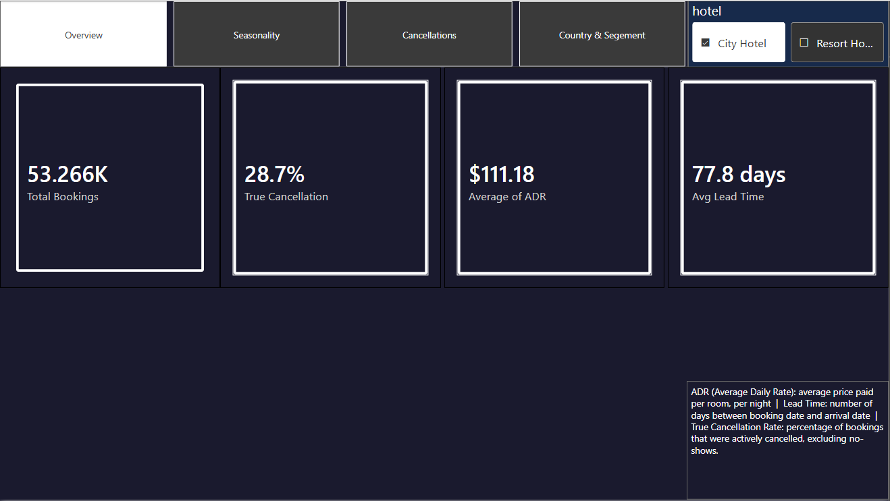
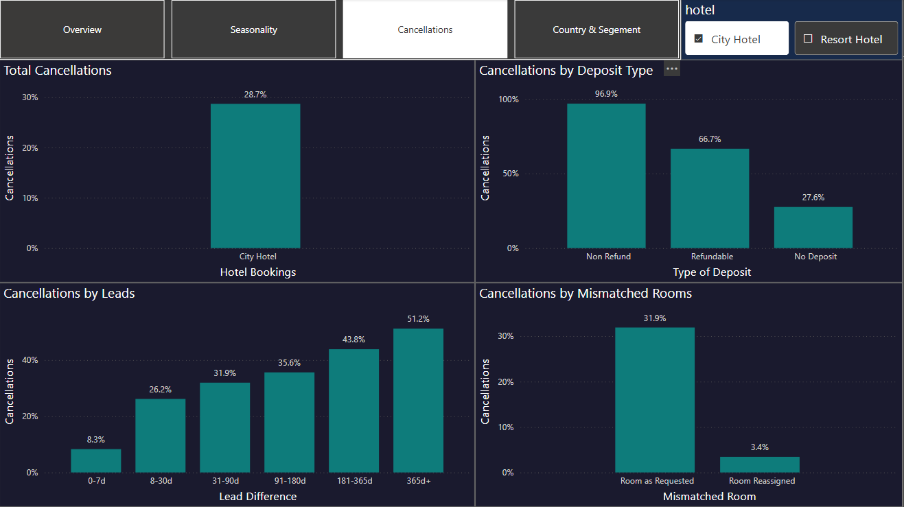

# Hotel Booking Demand Analysis 🏨

A Power BI dashboard analyzing hotel booking data to uncover what drives 
cancellations, how demand shifts seasonally, and where bookings come from — 
with a focus on turning raw booking data into decisions a hotel could 
actually act on.

## 🎯 Objective
Understand cancellation behavior, seasonal demand patterns, and booking 
sources across two hotel types, and surface the operational levers behind 
a 28.7% cancellation rate.

## 🛠️ Tools
- Power BI
- DAX (calculated measures: True Cancellation Rate, Average Lead Time, ADR)

## 📊 Dashboard Pages
1. **Overview** — key metrics at a glance
2. **Seasonality** — booking volume and pricing trends over time
3. **Cancellations** — cancellation drivers by deposit type, lead time, and room mismatch
4. **Country & Segment** — booking sources by country and marketing channel

## 📈 Key Findings

- **53,266 bookings** analyzed, with a **28.7%** true cancellation rate (excluding no-shows)
- **Cancellation risk climbs sharply with lead time**: bookings made 0-7 days out cancel just 8.3% of the time — bookings made 365+ days in advance cancel **51.2%** of the time
- **Deposit type is a massive predictor**: non-refundable bookings cancel at **96.9%**, vs. 66.7% for refundable and 27.6% for no-deposit bookings
- **Room mismatches drive cancellations**: bookings where the guest didn't get their requested room cancel at **31.9%**, nearly 10x the rate of correctly-assigned rooms (3.4%)
- **Average Daily Rate (ADR) is seasonal and volatile** — peaking above $200 in August, with resort hotel pricing swinging more than city hotel pricing across the year
- **Online Travel Agents (OTA) dominate bookings** (34.9K of all bookings) but also carry the highest cancellation rate among channels (34.9%), alongside Groups (33.1%)

## 💡 Takeaways
- Non-refundable deposits appear to correlate with speculative or low-commitment bookings rather than reducing cancellations — worth re-examining deposit policy design
- Long lead-time bookings carry disproportionate cancellation risk and may need different overbooking/forecasting assumptions than near-term bookings
- Room-assignment accuracy is a low-cost, high-impact lever — mismatches are tied to a cancellation rate 9x higher than correctly matched rooms

## 🖼️ Dashboard Previews




## 📁 Files
```
Hotel-Booking-Demand-Dashboard/
├── Dashboard/   → .pbix file
├── Images/      → dashboard screenshots
└── README.md
```
